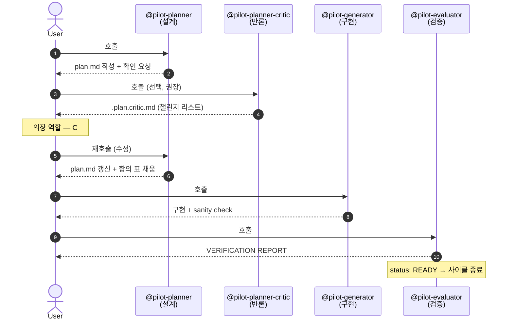

# 에이전트 흐름

pilot은 명시적으로 호출되는 4개의 agent를 통해 하나의 feature 개발 cycle을 진행합니다. 모든 agent는 `orchestrate-load.py`로 로드된 동일한 context를 공유하지만, 각자 고유의 역할과 관점을 가집니다.

## 흐름 시퀀스

명시적 호출은 `@agent_name` 형태로 수행되며, 사용자는 각 phase 사이에서 plan, critic 피드백, 구현 결과를 검토하고 의사결정을 내릴 수 있습니다.

## 에이전트별 역할 분리

동일한 context를 서로 다른 시각에서 검증한다는 점이 핵심입니다.

| 에이전트 | 기본 자세 | 금지 사항 |
|---|---|---|
| **Planner** | 한 발 물러나 영향 범위와 의존성을 먼저 살핀다. | 한 번에 3단계를 초과하는 계획 수립 / 영향 받는 파일 목록이 비어 있는 단계 작성 금지 |
| **Planner-Critic** | 전제 조건, 범위, edge case, 대안적 접근법 등을 의심하고 검증한다. | code나 plan 직접 수정 금지 / 모호하고 일반적인 지적 지양 / 개인 선호를 blocking 이슈로 격상 금지 |
| **Generator** | 기존 code 패턴을 우선적으로 재사용한다. 불필요한 추상화는 지양한다. | 기존 패턴 대신 새로운 helper나 추상화 계층 임의 신설 금지 / 요구사항 범위를 벗어난 오버엔지니어링 금지 |
| **Evaluator** | 명확한 검증 데이터(증거) 없이는 통과시키지 않는다. 반려에 타협하지 않는다. | 구현자의 의도를 임의로 추정해 통과시키는 행위 금지 / 증거 확인 없이 `status: READY`를 부여하는 행위 금지 |

## Critic의 1.5-pass 구조

critic은 작성된 `plan.md`를 검토하되, 이를 직접 수정하지 않습니다. 피드백은 `.plan.critic.md`에 기록되며, 이후 planner가 재호출되어 사용자가 수용 여부를 결정한 피드백을 바탕으로 `plan.md`를 업데이트하고 합의 표(`accepted | rejected | deferred`)를 작성합니다.

이러한 역할 분리를 통해 얻을 수 있는 이점은 다음과 같습니다:

- **사용자가 중재자(의장) 역할 수행** — AI 간의 자동 토론에 의존하지 않고 사용자가 직접 의사를 결정합니다.
- **의사결정 이력 보존** — 어떤 피드백이 어떻게 처리되었는지가 git diff 기록으로 명확히 남습니다.
- **수렴 신호 제공** — 동일한 피드백이 3 round 이상 반복된다면 plan의 문제가 아니라 요구사항 자체가 모호하다는 신호입니다. 이때 사용자는 상황을 인지하고 `features/NN-*.md` 파일의 요구사항을 구체화해야 합니다.

## pilot-code-review와의 책임 경계

`@pilot-code-review`는 위 cycle 외부에 존재하는 독립된 agent입니다:

| 에이전트 | 검토 대상 | 호출 시점 |
|---|---|---|
| `@pilot-planner-critic` | *작성된 계획* (`plan.md`) | planner 완료 직후, generator 실행 전 |
| `@pilot-code-review` | *작성된 코드* (`git diff`) | evaluator 검증 완료 후, PR(Pull Request) 생성 전 |

두 agent 모두 비판적인 review 역할을 수행하지만, 검토 대상이 다릅니다.

## 호출 순서 제약

- generator를 호출하기 전에 `plan.md`가 반드시 존재해야 합니다 (실행 시 `plan-validate.py`가 형식을 검증합니다).
- evaluator를 호출하기 전에 generator의 구현 작업이 완료되어야 합니다.
- critic 단계는 선택 사항입니다 — 단순한(trivial) 수정 시에는 생략해도 무방합니다.

자동화된 pipeline이 아닌 각 phase 사이에 사용자가 유연하게 개입할 수 있습니다. 진행 방향이 잘못되었다면 즉시 중단하고 설정을 조정할 수 있습니다.

## 다음 단계

- [모드 — Standard / TDD / Characterize](modes.md): `.agent-state.yml` 설정(`tdd`, `mode`)에 따른 4개 agent의 역할 확장 방식
- [Workspace 레이아웃](workspace-layout.md): agent가 참조하는 `workspace/` 디렉토리 구조 및 구성 정보
- Reference: [`@pilot-planner`](../reference/agents/pilot-planner.md) · [`@pilot-planner-critic`](../reference/agents/pilot-planner-critic.md) · [Identity SSOT](../reference/identity.md)
