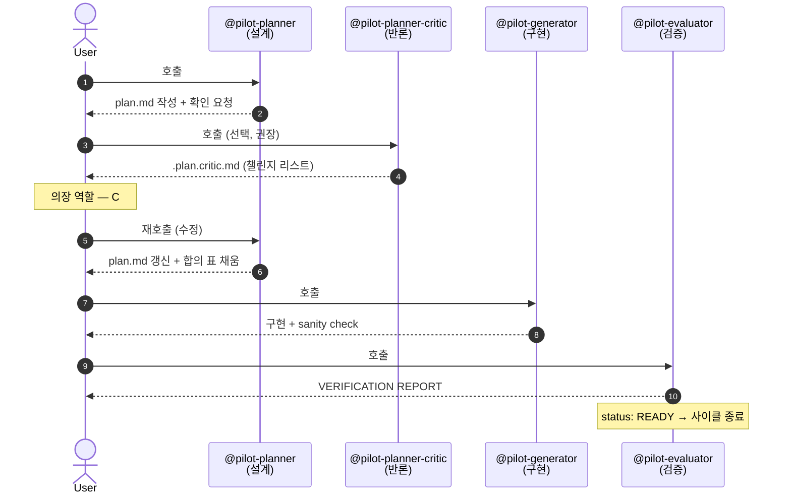

# 에이전트 흐름

pilot 은 4 개의 *명시 호출* 에이전트로 한 feature 의 사이클을 진행합니다. 각 에이전트는 동일한 컨텍스트 (`orchestrate-load.py` 결과) 위에서 동작하지만 **맡는 역할과 관점이 다릅니다**.

## 흐름 시퀀스

명시 호출은 `@에이전트명` 형태 — 각 호출 사이에 사용자가 plan/critic/구현 결과를 검토합니다.

## 에이전트별 역할 분리

같은 컨텍스트를 *다른 시각* 으로 본다는 점이 핵심입니다.

| 에이전트 | 기본 자세 | 금지 |
|---|---|---|
| **Planner** | 한 발 물러나 영향 범위·의존성부터 본다 | 한 번에 3 단계 초과 / 영향 파일 비어 있는 단계 |
| **Planner-Critic** | 전제·범위·엣지케이스·대안을 의심한다 | 코드/plan 직접 수정 · 일반론적 지적 · 취향을 blocking 으로 격상 |
| **Generator** | 기존 패턴을 먼저 찾는다. 새 추상화는 비용 | 패턴 대신 새 헬퍼·추상화 신설 · 요구사항 밖 기능 |
| **Evaluator** | 증거 없으면 통과 없음. 반려에 인색하지 않다 | 의도 추정으로 통과 · 증거 없는 status: READY |

## Critic 의 1.5-pass 위치

critic 은 *작성된 plan* 을 보지만 *직접 수정하지 않습니다*. 결함은 `.plan.critic.md` 에 기록되고 planner 가 재호출되어 — *사용자가 어느 챌린지를 채택할지 결정한 후* — plan.md 를 수정하고 합의 표 (`accepted | rejected | deferred`) 를 채웁니다.

이 분리가 가져오는 효과:

- **사용자가 의장 역할** — 자동 토론이 아니라 사람이 가운데서 결정.
- **이력 보존** — 어느 챌린지가 어떻게 처리됐는지 git diff 에 남음.
- **수렴 신호** — 같은 챌린지가 3 라운드 반복되면 plan 이 아니라 *요구사항이 모호하다* 는 신호 (사용자가 인식하고 `features/NN-*.md` 를 손봄).

## pilot-code-review 와의 책임 경계

`@pilot-code-review` 는 위 사이클과 *별개의 독립 에이전트* 입니다:

| 에이전트 | 보는 대상 | 호출 시점 |
|---|---|---|
| `@pilot-planner-critic` | *작성된 계획* (`plan.md`) | planner 직후, generator 전 |
| `@pilot-code-review` | *작성된 코드* (`git diff`) | evaluator 통과 후, PR 올리기 전 |

둘 다 *비판적 검토* 역할이지만 대상이 다릅니다.

## 호출 강제 순서

- generator 호출 전에 plan.md 가 *반드시* 존재해야 합니다 (plan-validate.py 가 형식 검증).
- evaluator 호출 전에 generator 의 구현이 끝나야 합니다.
- critic 은 *선택* — trivial 변경에는 건너뛰어도 됩니다.

자동 파이프라인이 아니므로 phase 사이 사용자 개입이 자연스럽습니다 — 잘못된 방향이면 그 자리에서 중단·조정 가능.

## 다음

- [모드 — Standard / TDD / Characterize](modes.md) — `.agent-state.yml` 의 `tdd`·`mode` 에 따라 위 4 에이전트의 책임이 어떻게 확장되는지.
- [Workspace 레이아웃](workspace-layout.md) — 에이전트가 읽는 컨텍스트 (`workspace/`) 의 구조.
- Reference: [`@pilot-planner`](../reference/agents/pilot-planner.md) · [`@pilot-planner-critic`](../reference/agents/pilot-planner-critic.md) · [Identity SSOT](../reference/identity.md).
