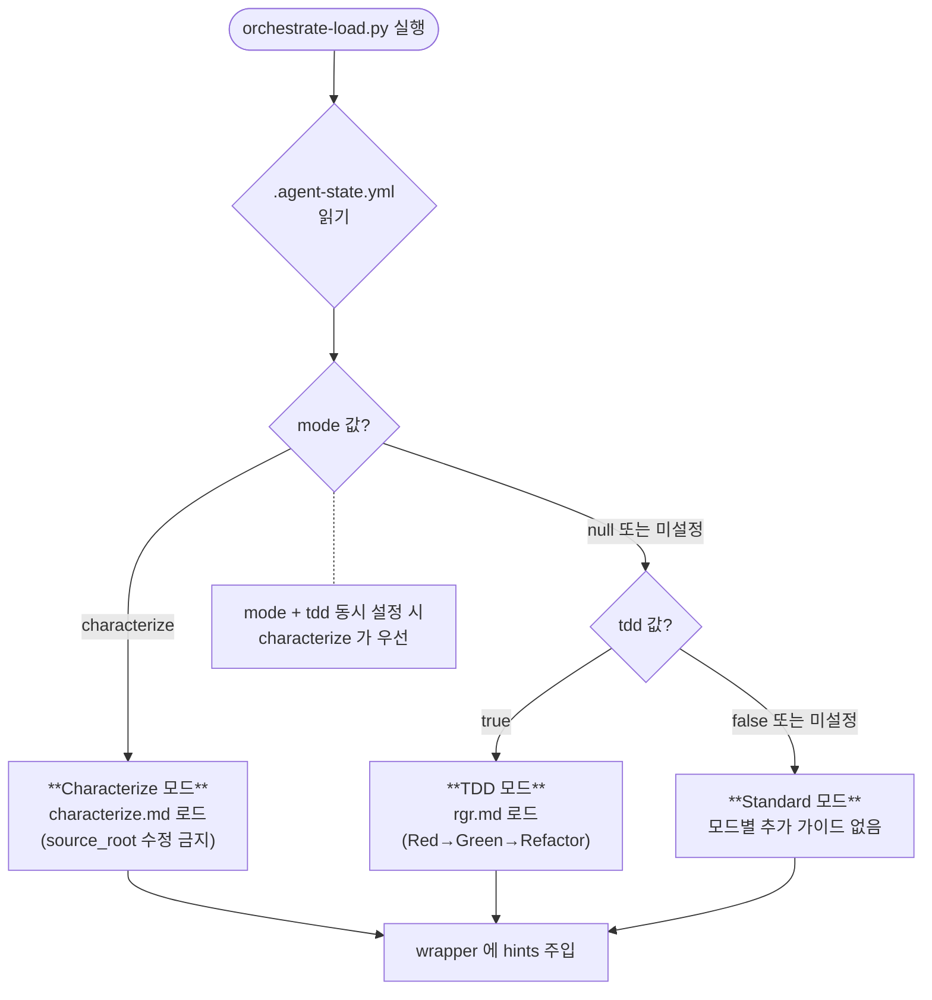

# 모드 — Standard / TDD / Characterize

`.agent-state.yml` 설정 파일의 `tdd` (Boolean) 값과 `mode` (`null` 또는 `"characterize"`) 값이 각 agent wrapper의 동작 방식을 결정합니다.

## 진입 분기

`tdd: true`와 `mode: characterize`가 동시에 설정된 경우, 안전망 확보가 더 시급하다고 판별하여 **characterize 모드가 우선** 적용됩니다.

## 모드별 책임 비교

| 구분 | Standard | TDD | Characterize |
|---|---|---|---|
| **Planner 산출물** | `plan.md` 자유 형식 | Red Contract — *test 대상 / 검증할 동작 / 예상 실패 유형 명시* | Characterization Contract — *입력값 / 현재 출력값 (placeholder) / 감지된 side effect 명시* |
| **Generator 행동** | 구현 작성 | 실패하는 test 작성 후 이를 통과시키는 *최소한의 구현* 진행 | `{source_root}` 수정 금지. **test 코드만 작성**하고, 이를 실행하여 '현재 출력값'을 측정 |
| **Evaluator 검증** | 요구사항 충족 및 패턴 일관성 | 변경 사항과 관련된 test 코드만 선택 실행 (`{test_command} {paths}`) | 작성된 test 코드가 기존의 동작을 왜곡 없이 정확하게 검증하는지 확인 |
| **plan-validate 강제** | 자유로운 형식 (문서 수준의 doc-level만 검증) | `### 스텝 목록` 섹션 필수 기재, 각 step에 3가지 label 정의 필수 | `### 스텝 목록 (Characterization Contract)` 섹션 필수 기재, 각 step에 4가지 label 정의 필수 |
| **적용 시점** | 요구사항이 명확하고, 검증용 test가 개발 cycle 내에서 자연스럽게 포함되는 경우 | 신규 기능 개발 시, 구현할 사양을 실행 및 검증 가능한 test 단위로 정의할 수 있는 경우 | 레거시 code의 *기존 동작 방식을 기록(characterize)*하여 리팩토링 안정성을 확보해야 하는 경우 |

상세 schema는 [plan-schema.md](https://github.com/radiostart/claude-plugins/blob/main/pilot/skills/context/lifecycle/plan-schema.md)가 SSOT입니다.

## 모드 전환

| 명령 | 효과 | 3-way 동기화 |
|---|---|---|
| `/pilot:tdd on` / `off` | `.agent-state.yml` + `project.md` + `prompts/*.md` 갱신 | 자동 |
| `/pilot:tdd --fix` | 3개 설정이 불일치할 때 정합성 강제 보정 | 사용자 확인 후 처리 |
| `/pilot:characterize` | `mode: characterize` 설정 | 자동 |
| `/pilot:characterize off` | `mode` 해제 | 자동 |

3-way 동기화 상태는 [Doctor 진단·마이그레이션](../how-to/doctor-migration.md) 스킬이 주기적인 검증을 수행합니다.

## mode와 tdd가 분리되어 설계된 이유

하나의 enum 형태(`mode: standard | tdd | characterize`)로 병합하는 것이 단순해 보일 수 있으나, 다음과 같은 구조적 이유로 분리되었습니다:

- **`tdd`는 프로젝트 전체에 적용되는 정책**입니다. 모든 feature 개발 시 Red Contract(실패하는 test 작성) 단계를 필수로 거치겠다는 선언적 설정입니다.
- **`mode: characterize`는 일시적인 모드**입니다. 특정 feature에 대해 *현재 동작 방식을 기록*하는 작업을 수행할 때만 임시로 사용됩니다. 작업 완료 후 모드를 비활성화하면 원래의 설정(tdd 또는 standard)으로 자연스럽게 복귀합니다.

두 설정을 분리하여, *TDD를 적용하는 프로젝트 내에서 특정 레거시 feature에만 임시로 characterize 모드를 활성화*하여 동작을 기록하고, 이를 바탕으로 TDD 리팩토링을 수행하는 복합적인 workflow를 유연하게 지원합니다.

## 다음 단계

- [Drift Protocol](drift-protocol.md): 모드 설정과 무관하게 context 정보가 실제 code와 어긋났을 때의 대처 규약
- How-to: [TDD 모드 활성화](../how-to/tdd-mode.md) · [Characterize 모드](../how-to/characterize-mode.md)
- Reference: [`/pilot:tdd`](../reference/skills/tdd.md) · [`/pilot:characterize`](../reference/skills/characterize.md)
