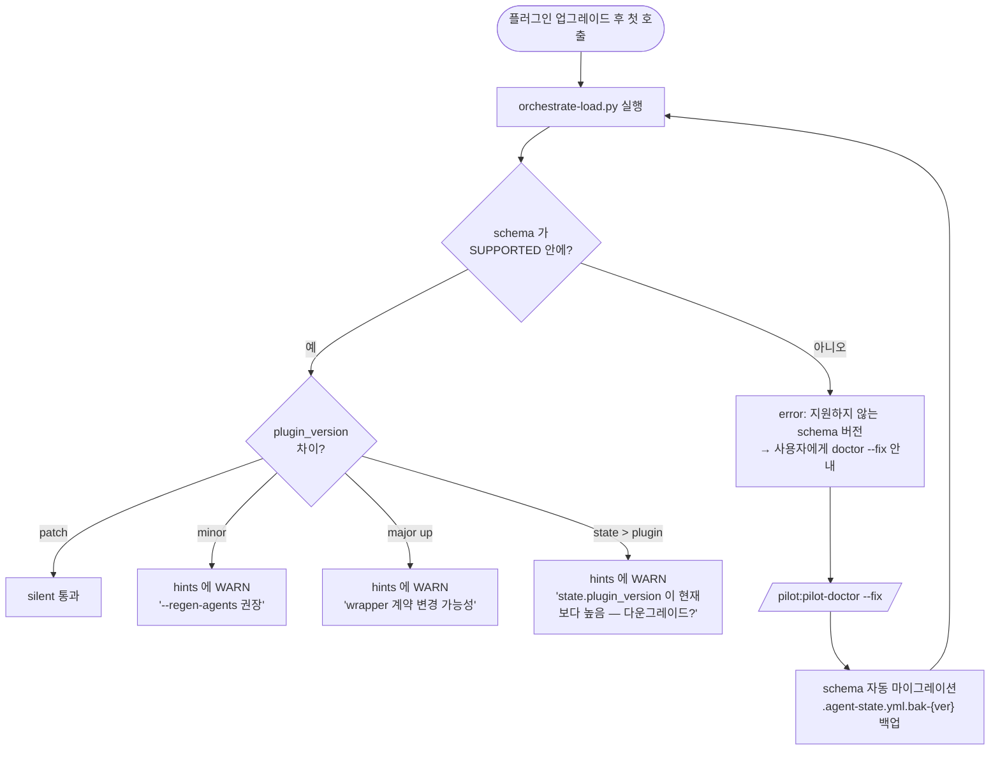

# 릴리스 · 업그레이드

plugin(`pilot/`) 업데이트 시 사용자 workspace(`workspace/`)를 동기화하고 관리하는 정책을 다룹니다.

## semver 와 wrapper 계약

`pilot/.claude-plugin/plugin.json`에 기재된 `version` 정보는 SemVer(Semantic Versioning) 규칙을 따릅니다:

| 구분 | 의미 | 사용자 조치 |
|---|---|---|
| **patch** (`0.5.0 → 0.5.1`) | bug fix, 문서 수정 등 wrapper contract나 schema의 변경이 없는 경우 | 없음. `orchestrate-load.py` 실행 시 경고 없이 silent하게 통과 |
| **minor** (`0.4.x → 0.5.0`) | 신규 기능 추가(예: `@pilot-planner-critic` 도입) 및 wrapper contract 변경 가능성 존재. schema는 backward-compatible함 | hints에 경고(WARN) 출력 — `/pilot:analyze --regen-agents` 실행 권장 |
| **major** (`0.x → 1.0`) | 하위 호환성 차단 및 schema migration 필요성 존재 | `/pilot:pilot-doctor --fix` 실행을 통한 migration 가이드 제공 |

`orchestrate-load.py`는 현재 `state.plugin_version` 설정값과 실행 중인 plugin 버전을 비교하여 알맞은 hint를 제공합니다.

## schema 버전 (`.agent-state.yml`)

plugin의 `version`과는 별개로 `.agent-state.yml` 내에 `schema` 필드가 정의되어 있습니다. 해당 schema의 구조가 변경되는 경우(예: 필수 필드 추가)에만 순차적으로 증가합니다:

| schema | 도입 버전 | 주요 변경 사항 |
|---|---|---|
| `v1.0` | 초기 | 기본 필드 구성 (`analyzed`, `tdd`, `domain`) |
| `v1.1` | 0.2.x | `plugin_version` 필드 추가 (선택 사항) |
| `v1.2` | 0.3.x | `mode` 필드 (`null` 또는 `"characterize"`) 추가 |

지원 가능한 schema 버전 정보는 `orchestrate-load.py` 내 `SUPPORTED_SCHEMAS` 변수가 SSOT(Single Source of Truth) 역할을 수행합니다. 지원 범위를 벗어나는 버전은 실행이 차단되며, 사용자에게 migration 안내 메시지를 제공하고 즉시 프로세스를 종료(exit)합니다.

## 마이그레이션 흐름

`/pilot:pilot-doctor --fix` 명령을 통한 migration은 다음과 같이 동작합니다:

- 누락된 필수 필드를 안전한 default 값으로 보충합니다 (`mode: null`, `plugin_version: "{현재버전}"`).
- 기존 설정값은 유실 없이 보존합니다. migration 프로세스는 필드 추가 및 보완만 수행하며, 기존 필드의 의미적 변경이 수반될 경우 release note에 가이드를 상세히 안내합니다.
- `.agent-state.yml.bak-v{이전}` 형태로 설정 백업 파일을 생성합니다.

## wrapper contract의 호환성

minor upgrade 시 wrapper contract의 호환성 변경이 의미하는 바는 다음과 같습니다:

- planner / critic / generator / evaluator 각 wrapper의 동작 step 절차가 변경될 수 있습니다 (예: critic 도입 시 planner step 8의 안내 메시지 갱신).
- `prompts/*.md` 파일의 사전 확인 사항(pre-check) 양식이 갱신될 수 있습니다.
- `--regen-agents` option은 위의 항목들을 현재 설치된 plugin 버전을 기준으로 다시 생성하되, 사용자가 수동 작성한 영역은 손실 없이 보존합니다.

하위 호환성이 완전히 차단되거나(drop) 의미적 정의가 변경될 경우 major version을 변경하고, release note에 migration 가이드를 명시합니다.

## Release 시 사용자 Workflow

1. plugin 패키지가 새 버전으로 업데이트됩니다 — `/plugin marketplace update radiostart-plugins` → `/plugin update pilot@radiostart-plugins`. `/plugin` 이 유일한 지원 경로입니다: 마켓플레이스 클론을 직접 당겨도 플러그인이 실제로 로드되는 `~/.claude/plugins/cache/{marketplace}/pilot/{version}/` 은 갱신되지 않습니다.
2. **세션 재시작** 후 새 session 시작 → `orchestrate-load.py`가 `plugin_version` 불일치 감지 → hints에 경고(WARN) 주입.
3. 사용자가 `/pilot:pilot-doctor` 명령 실행 → 전체 정합성 및 schema 버전 점검.
4. 필요 시 `/pilot:pilot-doctor --fix` 또는 `/pilot:analyze --regen-agents` 명령 실행.
5. 작업을 재개합니다.

## CHANGELOG

버전별 변경 요약은 [릴리스 노트](../release-notes.md)에 모여 있고, 커밋 단위의 원본 목록은 [GitHub Release Note](https://github.com/radiostart/claude-plugins/releases)가 SSOT입니다. minor version 이상의 변경이 발생하면 수정 대상이 된 SSOT 정보를 밝히고, 사용자가 이를 derived 파일에 어떻게 동기화할 수 있는지 가이드를 함께 제공합니다.

## 다음 단계

- [릴리스 노트](../release-notes.md): 버전별 변경 이력
- [SSOT와 Derived](ssot-and-derivation.md): 데이터 및 문서의 SSOT 기준과 파생 관계
- How-to: [Doctor 진단·마이그레이션](../how-to/doctor-migration.md) — 실제 마이그레이션 실행 및 진단 흐름
- Reference: [`/pilot:pilot-doctor`](../reference/skills/pilot-doctor.md) · [`state-schema.md`](https://github.com/radiostart/claude-plugins/blob/main/pilot/skills/context/lifecycle/state-schema.md)
