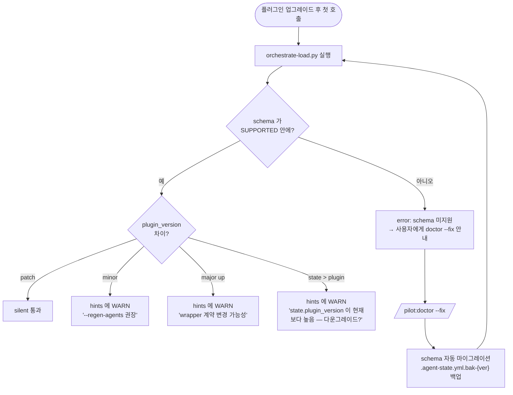

# 릴리스 · 업그레이드

플러그인 (`pilot/`) 이 진화할 때 사용자 워크스페이스 (`workspace/`) 가 어떻게 따라가는지의 정책.

## semver 와 wrapper 계약

`pilot/.claude-plugin/plugin.json` 의 `version` 은 semver 를 따릅니다:

| 차이 | 의미 | 사용자 조치 |
|---|---|---|
| **patch** (`0.5.0 → 0.5.1`) | 버그 수정·문서 변경. wrapper 계약·schema 변경 없음 | 없음. `orchestrate-load.py` 가 silent 통과 |
| **minor** (`0.4.x → 0.5.0`) | 새 기능 추가 (예: `@pilot-planner-critic` 도입). wrapper 계약 가능. schema 는 backward-compatible | hints 에 WARN 출력 — `/pilot:analyze --regen-agents` 권장 |
| **major** (`0.x → 1.0`) | 호환성 깨짐. schema 마이그레이션 필요할 수도 | `/pilot:doctor --fix` 가 마이그레이션 안내 |

`orchestrate-load.py` 는 `state.plugin_version` 과 *현재 실행 플러그인 버전* 을 비교해서 위 표대로 hint 를 띄웁니다.

## schema 버전 (`.agent-state.yml`)

플러그인 `version` 과 *별개* 로 `schema:` 필드가 있습니다. schema 가 바뀌어야 하는 경우 (예: 새 필수 필드 추가) 만 증가:

| schema | 도입 시 | 변경점 |
|---|---|---|
| `v1.0` | 초기 | 기본 필드 (`analyzed`·`tdd`·`domain`) |
| `v1.1` | 0.2.x | `plugin_version` 필드 추가 (optional) |
| `v1.2` | 0.3.x | `mode` 필드 (`null` 또는 `"characterize"`) 추가 |

지원 schema 는 `orchestrate-load.py` 의 `SUPPORTED_SCHEMAS` 가 SSOT. 그 외 버전은 *명시적으로 거부* — 사용자에게 마이그레이션 안내 메시지 출력 후 exit.

## 마이그레이션 흐름

`doctor --fix` 의 마이그레이션은:

- 누락된 필수 필드를 안전한 default 로 채움 (`mode: null`·`plugin_version: "{현재}"`).
- 기존 값은 보존 — 마이그레이션은 *추가만*, 기존 필드 의미 변경은 별도 release note 에서 안내.
- `.agent-state.yml.bak-v{이전}` 백업.

## wrapper 계약의 호환성

minor upgrade 의 *wrapper 계약 변경 가능성* 이 무엇을 의미하는지:

- planner / critic / generator / evaluator wrapper 의 *step 절차* 가 바뀔 수 있음 (예: critic 도입 시 planner step 8 안내문 변경).
- `prompts/*.md` 의 사전 확인 사항 양식이 바뀔 수 있음.
- `--regen-agents` 가 위 둘을 *현재 플러그인 버전 기준* 으로 재생성. 사용자 작성 영역은 보존.

호환성이 깨지면 (drop 또는 의미 변경) major 로 분류, release note 에 마이그레이션 가이드 명시.

## release 시 사용자 흐름

1. 플러그인이 새 버전으로 캐시 갱신 (Claude Code 의 marketplace 또는 수동 `pip`·`git pull`).
2. 새 세션 시작 → `orchestrate-load.py` 가 `plugin_version` 차이 감지 → hints 에 WARN.
3. 사용자가 `/pilot:doctor` 실행 → 정합성·schema 확인.
4. 필요하면 `/pilot:doctor --fix` 또는 `/pilot:analyze --regen-agents`.
5. 작업 재개.

## CHANGELOG

본 사이트의 [`reference`](../reference/index.md) 와 GitHub release notes 가 변경사항의 SSOT. minor 이상 변경 시 *어떤 SSOT 가 바뀌었는지* 를 명시 — 사용자가 그 SSOT 를 derived 파일에서 어떻게 갱신할지 안내합니다.

## 다음

- [SSOT 와 derived](ssot-and-derivation.md) — 어느 derived 파일이 어떻게 자동 갱신되는지.
- How-to: [Doctor 진단·마이그레이션](../how-to/doctor-migration.md) — 실제 마이그레이션 실행.
- Reference: [`/pilot:doctor`](../reference/skills/doctor.md) · [`state-schema.md`](https://github.com/radiostart/claude-plugins/blob/main/pilot/skills/context/lifecycle/state-schema.md).
