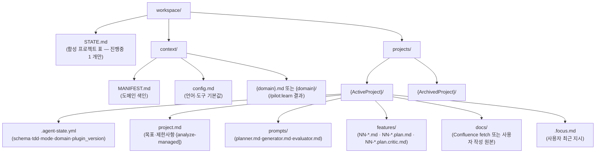

# Workspace 레이아웃

pilot의 *User-Facing 메타 구조*입니다. `workspace/` 디렉토리는 하나의 git working tree당 1개만 정의되며, 여러 project를 생성할 수 있으나 **활성화(진행중) 상태인 project는 항상 1개**로 제한됩니다.

## 전체 구조

## 두 영역의 책임

### `context/` — 도메인 지식 (워크스페이스 공유)

여러 project가 도메인 지식을 *공유*합니다. 예를 들어 `coupon_service` 도메인을 참조하는 project가 3개이더라도 `context/coupon_service.md` 파일은 단 하나만 존재합니다. 구현 코드가 변경되면 이 파일 한 곳만 갱신하면 됩니다.

- `MANIFEST.md` — `## 도메인 분류` 섹션의 표 형식으로 진입 파일(entry file) 목록을 관리합니다. `orchestrate-load.py` 스크립트가 활성 project의 domain에 매핑되는 진입 파일을 탐색하여 자동으로 read합니다.
- `config.md` — 언어 및 tool의 기본값 설정(`test_command`, `source_root`, `lint_command` 등). project별 override 설정은 `project.md` 파일 내의 제약사항 섹션에서 구성합니다.

### `projects/{P}/` — 프로젝트별 산출물 (격리)

활성 project가 동시에 단 1개만 허용되는 제약은 `orchestrate-load.py`에서 제어합니다. `STATE.md` 내에서 '진행중'인 project가 2개 이상일 경우 error를 발생시키고 실행을 거부합니다. 그 원인은 다음과 같습니다:

- `.focus.md`가 project 단위로 1개만 존재하므로, 서로 다른 두 작업 흐름의 focus가 교차되거나 섞이는 문제를 원천 방지하기 위함입니다.
- evaluator의 전달사항 역시 동일한 `project.md` 파일 내의 특정 영역에 기록되므로, 동시 진행 시 context 인수인계가 꼬일 수 있습니다.
- generator가 동일한 codebase를 제어하므로 병합(merge) 단위 분리가 어렵고, 단일 commit history에 뒤섞이게 됩니다.

여러 작업을 완전히 병렬로 진행하려면 [git worktree](https://git-scm.com/docs/git-worktree) 기능을 활용하여 분리해야 합니다 (각 worktree는 독립된 `workspace/STATE.md`를 가지게 됩니다).

## 영구 파일 vs 일시 파일

| 파일 | 분류 | git tracked 여부 |
|---|---|---|
| `STATE.md` · `MANIFEST.md` · `config.md` | 영구 파일 | tracked |
| `projects/{P}/project.md` · `prompts/*.md` · `features/NN-*.md` | 영구 파일 | tracked |
| `.agent-state.yml` | 영구 파일 (machine-readable 상태) | tracked |
| `features/NN-*.plan.md` · `.plan.critic.md` | 영구 파일 (작업 이력 기록) | tracked |
| `.focus.md` | 일시 파일 (새로운 focus로 덮어쓰기 가능) | 프로젝트 정책에 따라 tracked 혹은 gitignored 설정 |
| `.focus.history/` | 일시 파일 (자동 백업 아카이브) | 보통 gitignored 처리 |
| `.prompts.bak/` | 일시 파일 (`/pilot:analyze --regen-agents` 실행 시 자동 백업) | gitignored 처리 |

## 활성 프로젝트 전환

활성 project를 1개로 제한하므로, 다른 project로 전환하기 위해서는 다음 단계를 따릅니다:

1. 현재 project의 evaluator가 `status: READY` 상태인지 확인합니다. 아직 완료되지 않았다면 다른 작업으로 전환하기 전 진행 상태를 점검하라는 신호입니다.
2. `STATE.md` 파일 내에서 현재 project의 상태를 진행중에서 '완료' 또는 '보류'로 상태를 갱신합니다.
3. `/pilot:project {다른_프로젝트_이름}` 명령을 실행하여 새 project를 활성화합니다.

## 다음 단계

- [에이전트 흐름](agent-flow.md): 위의 workspace 레이아웃 구조 내에서 4개 agent가 참조하고 갱신하는 파일 흐름
- [SSOT와 Derived](ssot-and-derivation.md): `context/` 및 `projects/{P}/` 내 데이터의 SSOT 구분 기준
- Reference: [`STATE.md` 형식](https://github.com/radiostart/claude-plugins/blob/main/pilot/skills/context/lifecycle/setup/templates/STATE.md.template) · [`state-schema.md`](https://github.com/radiostart/claude-plugins/blob/main/pilot/skills/context/lifecycle/state-schema.md)
