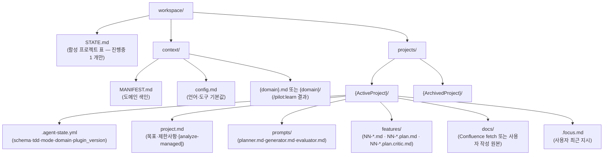

# Workspace 레이아웃

pilot 의 *사용자 facing 메타구조*. `workspace/` 는 한 git 작업 트리당 1 개, 안에 여러 프로젝트를 둘 수 있지만 **활성 (`진행중`) 은 항상 1 개** 입니다.

## 전체 구조

## 두 영역의 책임

### `context/` — 도메인 지식 (워크스페이스 공유)

여러 프로젝트가 *공유* 합니다. 예: `coupon_service` 도메인을 만지는 프로젝트가 3 개 있어도 `context/coupon_service.md` 는 1 개. 코드가 바뀌면 한 곳만 갱신.

- `MANIFEST.md` — `## 도메인 분류` 표가 진입 파일 목록. `orchestrate-load.py` 가 여기서 활성 프로젝트의 도메인 → 진입 파일을 매칭해 자동 Read.
- `config.md` — 언어 / 도구 기본값 (`test_command` · `source_root` · `lint_command` 등). 프로젝트별 override 는 `project.md` 제한사항에서.

### `projects/{P}/` — 프로젝트별 산출물 (격리)

활성 프로젝트가 *한 번에 1 개* 라는 강제는 `orchestrate-load.py` 에서 옵니다 — `STATE.md` 의 *진행중* 행이 2 개 이상이면 에러로 거부. 이유:

- `.focus.md` 가 프로젝트 단위 단일이라 *두 흐름의 focus 가 섞일 수 없기* 때문.
- evaluator 의 "전달사항" 도 `project.md` 의 동일 섹션에 적힘 — 동시 진행 시 인수인계가 섞임.
- generator 가 같은 코드베이스를 만지므로 *머지 단위 자체가 없음* — 한 commit history 에 섞여 들어감.

여러 feature 를 *진짜 병렬* 로 진행하려면 [git worktree](https://git-scm.com/docs/git-worktree) 로 분리합니다 (각 worktree 가 자기 `workspace/STATE.md` 를 가짐).

## 영구 파일 vs 일시 파일

| 파일 | 영구 vs 일시 | git tracked 여부 |
|---|---|---|
| `STATE.md` · `MANIFEST.md` · `config.md` | 영구 | tracked |
| `projects/{P}/project.md` · `prompts/*.md` · `features/NN-*.md` | 영구 | tracked |
| `.agent-state.yml` | 영구 (machine-readable 상태) | tracked |
| `features/NN-*.plan.md` · `.plan.critic.md` | 영구 (작업 흔적) | tracked |
| `.focus.md` | 일시 (사용자가 `--clear` 또는 새 focus 로 덮어쓰기) | tracked 또는 gitignored — 팀 정책에 따라 |
| `.focus.history/` | 일시 (자동 아카이브) | 보통 gitignored |
| `.prompts.bak/` | 일시 (`/pilot:analyze --regen-agents` 백업) | gitignored |

## 활성 프로젝트 전환

진행중 1 개 강제이므로 다른 프로젝트로 전환하려면:

1. 현재 프로젝트의 evaluator 가 `status: READY` 인지 확인 — 미완료라면 그 자체가 신호.
2. `STATE.md` 의 진행중 → 완료 또는 보류 로 옮김.
3. `/pilot:project {다른_프로젝트}` 로 새 프로젝트 활성화.

## 다음

- [에이전트 흐름](agent-flow.md) — 위 구조 위에서 4 에이전트가 어떤 파일을 읽고 쓰는지.
- [SSOT 와 derived](ssot-and-derivation.md) — `context/` 와 `projects/{P}/` 의 어디까지가 SSOT 인지.
- Reference: [`STATE.md` 형식](https://github.com/radiostart/claude-plugins/blob/main/pilot/skills/context/lifecycle/setup/templates/STATE.md.template) · [`state-schema.md`](https://github.com/radiostart/claude-plugins/blob/main/pilot/skills/context/lifecycle/state-schema.md).
